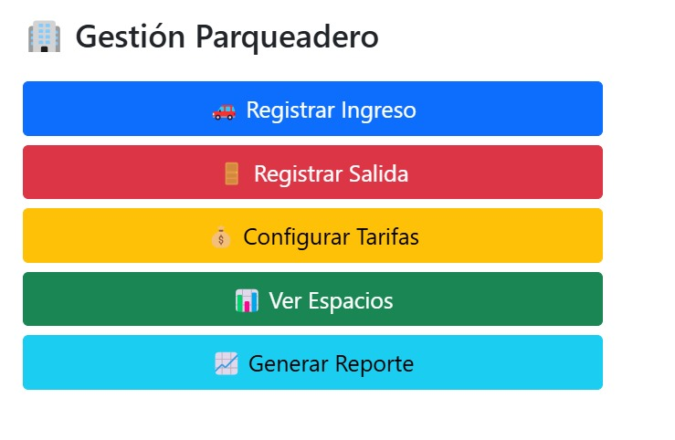
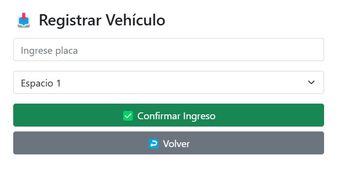
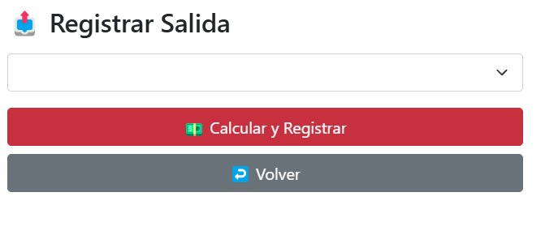
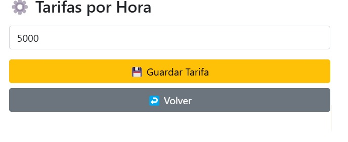
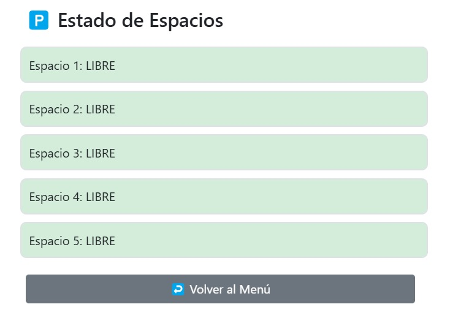
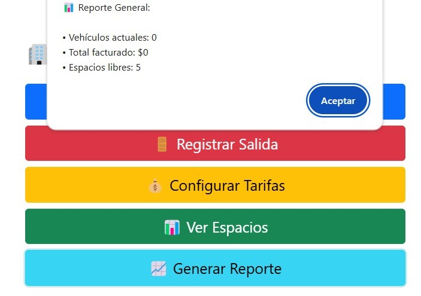

## HU02 - Diseño del Programa para la Gestión del Parqueadero

Descripción:

Como administrador
Quiero tener una interfaz clara y fácil de usar para gestionar el parqueadero
Para realizar el registro, salida y visualización de espacios de manera eficiente

Criterios de Aceptación:

La interfaz debe mostrar una lista de espacios de parqueo con información clara y visualmente diferenciada.

Debe utilizar colores (verde, azul y rojo) para identificar los espacios libres, ocupados y reservados.

Debe tener botones accesibles y bien organizados para las acciones de registro de vehículo, salida de vehículo y configuración de tarifas.

Debe permitir personalizar algunas vistas, como cambiar entre listas de espacios de parqueo.

Prioridad: Alta
Dependencias: ninguna
Estimación: 3 SP

.png)

